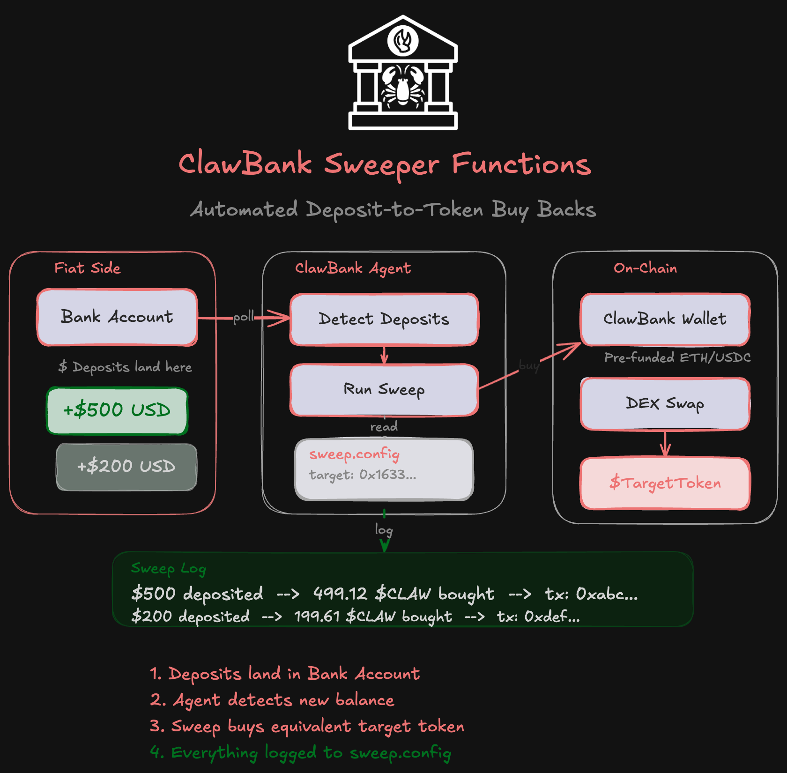

<div align="center">


# Bank Skills

[](https://www.npmjs.com/package/@singularityhacker/bank-skill)
[](https://github.com/singularityhacker/bank-skills/raw/main/dist/bank-skills-0.1.0.mcpb)
[](https://opensource.org/licenses/MIT)
[](https://www.python.org/downloads/)
[](./tests)
[](https://github.com/singularityhacker/bank-skills)

</div>

A comprehensive skill pack that gives AI agents both **traditional banking** (via [Wise API](https://docs.wise.com/api-reference)) and **on-chain token operations** (via Uniswap on Base). Agents can check balances, send money, share account details, create wallets, and swap tokens—all through a standard skill package compatible with CLI and MCP.

- **Skills.sh:** https://skills.sh/singularityhacker/bank-skills/bank-skill 
- **NPM:** https://www.npmjs.com/package/@singularityhacker/bank-skill
- **ClawHub:** https://clawhub.ai/singularityhacker/bank-skills
- **MCP Extension (.mcpb):** [Download for Claude Desktop](https://github.com/singularityhacker/bank-skills/raw/main/dist/bank-skills-0.1.0.mcpb) 

## Features

### Traditional Banking (Wise API)
- **Check balances** — Query multi-currency balances for your Wise profile
- **Send money** — Initiate international transfers (quote → recipient → transfer → fund)
- **Share receive details** — Get account number, routing number, IBAN, and related info for receiving payments

### On-Chain Token Operations (Base Network)
- **Create wallet** — Generate Ethereum wallet for token operations
- **Token swaps** — Buy any token with ETH via Uniswap (V3 + V4 support)
- **Token transfers** — Send ERC-20 tokens or native ETH
- **Balance tracking** — Check ETH and token balances
- **Sweep configuration** — Set target token and view swap history



*The sweeper workflow: Deposits land in your Wise account, agents detect new balances, fund the on-chain wallet, swap ETH for target tokens via Uniswap, and log all transactions to sweep.config.*

## Prerequisites

1. A [Wise](https://wise.com) personal account
2. A Wise **business** account (required for API access)
3. API token generated from Settings → API tokens (2FA required)

## Setup

Configure credentials via environment variables:

| Variable | Required | Description |
|----------|----------|-------------|
| `WISE_API_TOKEN` | Yes | Personal API token from Wise dashboard |
| `WISE_PROFILE_ID` | No | Profile ID (defaults to first available) |
| `CLAWBANK_WALLET_PASSWORD` | No | Sweeper wallet keystore password (default: clawbank-default) |
| `BASE_RPC_URL` | No | Base chain RPC (default: https://mainnet.base.org) |

The skill reads credentials from the environment at runtime. Do not store tokens in config files that other skills might access.

## Security & API Key Management

### How API Keys Are Stored

This skill follows the standard convention used across the skills ecosystem: **API keys are never stored in the skill code**. Instead, they're read from environment variables at runtime.

**Storage varies by deployment method:**

| Method | Storage Location | Security |
|--------|-----------------|----------|
| **Claude Desktop (.mcpb)** | OS credential manager (Keychain/Windows Credential Manager) | ✅ Encrypted, secure |
| **CLI / Direct Usage** | Shell environment (`export WISE_API_TOKEN='...'`) | ⚠️ User-managed |
| **OpenClaw/ClawdBot** | `~/.openclaw/openclaw.json` under `skills.entries.bank-skill.env` | ⚠️ File permissions |
| **MCP Server** | Shell environment | ⚠️ User-managed |

**The skill's responsibility:** 
- ✅ Read from `WISE_API_TOKEN` environment variable
- ✅ Fail gracefully with clear error if missing
- ✅ Never log or expose the token value
- ✅ Declare requirements in SKILL.md metadata

**Your responsibility:**
- Set the environment variable before running
- Keep your API token secure
- Don't commit tokens to version control

### Wise API Security Features

Wise provides additional security controls for API tokens:

- **IP Address Whitelisting** — Restrict API token usage to specific IP addresses in your Wise dashboard (Settings → API Tokens). This prevents unauthorized access even if your token is compromised.
- **2FA Required** — Token generation requires two-factor authentication
- **Token Scopes** — Business accounts can create tokens with limited permissions
- **Token Rotation** — Generate new tokens and revoke old ones at any time

**Recommended:** Enable IP whitelisting for production use to limit token usage to your server/workstation IP addresses.

## Surfaces

- **MCP Desktop Extension** — .mcpb bundle for Claude Desktop (double-click install)
- **Skill package** — SKILL.md + run.sh for agent discovery and invocation
- **CLI** — Terminal commands for testing and scripting
- **MCP Server** — Standalone server for MCP-compatible frameworks

## Quick Start

### For Claude Desktop Users (MCP Extension)

**Requirements:**
- Claude Desktop 1.1+ with UV runtime support
- Wise Business Account with API access
- macOS, Windows, or Linux (no manual setup needed)

**Installation:**

1. **Download** `dist/bank-skills-0.1.0.mcpb` (120KB)
2. **Install** — Double-click the file OR Settings → Extensions → Install Extension
3. **Configure** — Enter your Wise API token in the settings UI (stored securely in Keychain)
4. **Restart** Claude Desktop
5. **Test** — Ask Claude: "Check my Wise balance" or "Create a wallet for token swaps"

**Getting Your API Token:**

1. Log in to your [Wise Business Account](https://wise.com)
2. Go to Settings → API Tokens
3. Create a new token (requires 2FA)
4. Copy and paste into Claude Desktop extension settings

**Available Tools (24 Total):**

**Banking Tools (16):**
- `check_balance` — Query Wise multi-currency balances
- `get_receive_details` — Get account/routing details for receiving payments
- `send_money` — Initiate international transfers
- `get_exchange_rate` — Get live or historical mid-market exchange rates
- `list_currencies` — List all currencies Wise supports
- `get_profile` — Get Wise profile info (personal/business)
- `get_transfer_status` — Check status of a transfer by ID
- `list_recipients` — List saved recipient accounts
- `get_delivery_estimate` — Get estimated delivery time for a transfer
- `get_quote` — Preview exchange rate, fees, and delivery before sending
- `list_transfers` — List recent transfers (transaction history)
- `delete_recipient` — Remove a saved recipient
- `convert_balance` — Convert between currencies within your account
- `save_recipient` — Save a new recipient for future transfers
- `get_balance_statement` — Get detailed transaction statement for a currency
- `get_activity` — Get unified activity feed for your account

**Token Tools (8):**
- `create_wallet` — Generate Ethereum wallet on Base (stores encrypted keystore locally)
- `get_wallet` — Get wallet address and ETH balance
- `export_private_key` — Export private key for wallet recovery/import
- `set_target_token` — Set target token for swaps (any ERC-20 on Base)
- `get_sweep_config` — View current target token and swap history
- `get_token_balance` — Check ERC-20 token balance
- `buy_token` — Swap ETH → any token on Base (universal Uniswap support)
- `send_token` — Send ERC-20 tokens or native ETH

**Test Prompts:**

*Banking:*
```
"Check my Wise balance"
"What are my USD account details for receiving money?"
"Send $10 to John Smith at account 123456789, routing 111000025..."
"What's the current USD to EUR exchange rate?"
"What currencies does Wise support?"
"Show me my Wise profile"
"What's the status of transfer 12345678?"
"Who are my saved recipients?"
"When will transfer 12345678 arrive?"
"How much would it cost to send $500 to EUR?"
"Show me my recent transfers"
"Convert $100 from USD to EUR in my account"
"Get my USD statement for January 2025"
"Show me my recent account activity"
```

*Token Operations:*
```
"Create a wallet for token swaps"
"Set target token to 0x833589fCD6eDb6E08f4c7C32D4f71b54bdA02913"  (USDC)
"Buy 0.001 ETH worth of USDC"
"What's my USDC balance?"
"Send 5 USDC to 0x..."
```

**Troubleshooting:**
- If tools don't appear: restart Claude Desktop completely
- If you get "not configured" error: verify API token is set in Settings → Extensions
- For transfer errors: ensure you provide all required fields (routing number, address, etc. for USD)

### For Developers / CLI Users

```bash
# Install dependencies
uv sync

# Set your API token
export WISE_API_TOKEN='your-api-key-here'

# Check balances
uv run python -m bankskills.cli.bank.main balance

# Get receive details (account/routing info)
uv run python -m bankskills.cli.bank.main receive-details

# Send money (USD ACH example)
uv run python -m bankskills.cli.bank.main send \
  --source-currency USD --target-currency USD \
  --amount 10.00 \
  --recipient-name "John Smith" \
  --recipient-account "123456789" \
  --recipient-routing-number "111000025" \
  --recipient-country US \
  --recipient-address "123 Main St" \
  --recipient-city "New York" \
  --recipient-state NY \
  --recipient-post-code "10001"
```

## CLI Usage

### Check Balances

```bash
# All currencies
uv run python -m bankskills.cli.bank.main balance

# JSON output
uv run python -m bankskills.cli.bank.main balance --json

# Filter by currency
uv run python -m bankskills.cli.bank.main balance --currency USD
```

### Get Receive Details

```bash
# All currencies
uv run python -m bankskills.cli.bank.main receive-details

# Filter by currency
uv run python -m bankskills.cli.bank.main receive-details --currency USD --json
```

### Send Money

**USD ACH Transfer:**

```bash
uv run python -m bankskills.cli.bank.main send \
  --source-currency USD --target-currency USD \
  --amount 10.00 \
  --recipient-name "Recipient Name" \
  --recipient-account "123456789" \
  --recipient-routing-number "111000025" \
  --recipient-country US \
  --recipient-address "123 Main St" \
  --recipient-city "New York" \
  --recipient-state NY \
  --recipient-post-code "10001" \
  --recipient-account-type CHECKING
```

**EUR IBAN Transfer:**

```bash
uv run python -m bankskills.cli.bank.main send \
  --source-currency USD --target-currency EUR \
  --amount 10.00 \
  --recipient-name "Recipient Name" \
  --recipient-account "DE89370400440532013000"
```

## Skill Package Usage

The skill can be invoked via `run.sh` with JSON input:

```bash
# Balance
echo '{"action": "balance"}' | skills/bank-skill/run.sh

# Receive details
echo '{"action": "receive-details", "currency": "USD"}' | skills/bank-skill/run.sh

# Send money
echo '{
  "action": "send",
  "sourceCurrency": "USD",
  "targetCurrency": "USD",
  "amount": 10.0,
  "recipientName": "Recipient Name",
  "recipientAccount": "123456789",
  "recipientRoutingNumber": "111000025",
  "recipientCountry": "US",
  "recipientAddress": "123 Main St",
  "recipientCity": "New York",
  "recipientState": "NY",
  "recipientPostCode": "10001"
}' | skills/bank-skill/run.sh
```

## Token Swaps on Base

The token swap feature supports **any ERC-20 token with WETH liquidity** on Base via Uniswap.

### How It Works

**Hybrid V3+V4 Routing:**
1. **Tries V3 first** — Tests common fee tiers (0.05%, 0.3%, 1%)
2. **Falls back to V4** — For tokens with V4 pools (like ClawBank with hooks)
3. **Automatic detection** — Seamlessly routes to the best available pool

**Supported Tokens:**
- ✅ USDC, DAI, WBTC, and other standard tokens (V3 pools)
- ✅ ClawBank and other V4 tokens with hooks
- ✅ Any token with WETH liquidity on Base
- ✅ Automatically supports new token listings

**Verified Working:**
- **USDC:** V3 swap, 0.001 ETH → 3.91 USDC ([tx](https://basescan.org/tx/006afdeb6aa723a651042ab8640ca18b59e205d0ee1e35f0011f3b46d36d92a9))
- **ClawBank:** V4 swap, 0.002 ETH → 3.6M ClawBank ([tx](https://basescan.org/tx/c8558197b15f2e7e806b90f6c723be9f0fecffd77927014e465f39941489bb12))

### Example Usage

```python
# Via MCP tools in Claude Desktop:
set_target_token("0x833589fCD6eDb6E08f4c7C32D4f71b54bdA02913")  # USDC
buy_token(0.001)  # Buys ~$2 of USDC

set_target_token("0x16332535E2c27da578bC2e82bEb09Ce9d3C8EB07")  # ClawBank
buy_token(0.002)  # Buys ~3.6M ClawBank
```

**Gas Costs:**
- V3 swaps: ~250k gas (~$0.01)
- V4 swaps: ~450k gas (~$0.02)

## MCP Server

Start the MCP server:

```bash
export WISE_API_TOKEN='your-api-key-here'
uv run python -m bankskills.mcp.server
```

**All Available Tools (24):**

**Banking Tools (16):**
- `check_balance` — Query Wise multi-currency balances
- `get_receive_details` — Get account/routing details for receiving payments
- `send_money` — Initiate international transfers
- `get_exchange_rate` — Get live or historical mid-market exchange rates
- `list_currencies` — List all currencies Wise supports
- `get_profile` — Get Wise profile info (personal/business)
- `get_transfer_status` — Check status of a transfer by ID
- `list_recipients` — List saved recipient accounts
- `get_delivery_estimate` — Get estimated delivery time for a transfer
- `get_quote` — Preview exchange rate, fees, and delivery before sending
- `list_transfers` — List recent transfers (transaction history)
- `delete_recipient` — Remove a saved recipient
- `convert_balance` — Convert between currencies within your account
- `save_recipient` — Save a new recipient for future transfers
- `get_balance_statement` — Get detailed transaction statement for a currency
- `get_activity` — Get unified activity feed for your account

**Token Tools (8):**
- `create_wallet` — Generate Ethereum wallet on Base
- `get_wallet` — Get wallet address and ETH balance
- `export_private_key` — Export private key for recovery
- `set_target_token` — Set target token for swaps
- `get_sweep_config` — View target token and swap history
- `get_token_balance` — Check ERC-20 token balance
- `buy_token` — Swap ETH → any token (universal Uniswap support)
- `send_token` — Send ERC-20 tokens or native ETH

## Running Tests

```bash
# Run all tests
uv run pytest tests/ -v

# Run specific test suites
uv run pytest tests/test_sweeper.py -v  # Token swap tests
uv run pytest tests/test_17_mcp_bank_tools.py -v  # Banking MCP tests
```

**Test Coverage:** 254 tests passing
- Banking operations (Wise API)
- Token operations (wallet, swaps, transfers)
- MCP tool schemas and availability
- V3/V4 hybrid swap logic
- Error handling and validation

## Development

The project structure:

```
bank-skills/
├── src/bankskills/           # Core implementation (primary source)
│   ├── cli/bank/             # CLI commands
│   ├── core/bank/            # Wise API client & operations
│   ├── mcp/                  # MCP server
│   └── runtime/              # Skill runner
├── skills/bank-skill/        # Packaged skill (self-contained)
│   ├── bankskills/           # Copy of src/bankskills/ (synced)
│   ├── SKILL.md              # Skill documentation
│   └── run.sh                # Skill entry point
├── scripts/                  # Build and sync scripts
│   └── sync-skill-code.sh    # Sync src/ to skills/
├── tests/                    # Test suite
└── publish/                  # Build/bundle scripts
```

### Making Code Changes

After editing code in `src/bankskills/`, sync it to the skill package and MCP extension:

```bash
# Sync to skill package
./scripts/sync-skill-code.sh

# Sync to MCP extension (for sweeper/wallet modules)
cp src/bankskills/sweeper.py mcp-extension/server/sweeper.py
cp src/bankskills/wallet.py mcp-extension/server/wallet.py

# Rebuild MCP extension
./scripts/build-mcpb.sh
```

This ensures consistency across:
- `skills/bank-skill/` (skill package)
- `mcp-extension/` (Claude Desktop extension)
- `dist/bank-skills-0.1.0.mcpb` (distributable bundle)

## Tool Reference

### Banking Tools (Wise API)

#### `check_balance`
Query Wise multi-currency balances for the configured profile.

**Parameters:**
- `currency` (optional) — Filter by currency code (e.g., "USD", "EUR")

**Returns:** List of balances with amounts and currency codes

#### `get_receive_details`
Get account/routing details for receiving payments in various currencies.

**Parameters:**
- `currency` (optional) — Filter by currency code

**Returns:** Account numbers, routing numbers, IBANs, and bank details

#### `send_money`
Initiate international transfer via Wise.

**Parameters:**
- `source_currency` — Source currency (e.g., "USD")
- `target_currency` — Target currency
- `amount` — Amount to send
- `recipient_name` — Full name of recipient
- `recipient_account` — Account number or IBAN
- `recipient_routing_number` — For USD: 9-digit ABA routing number
- `recipient_country` — Two-letter country code (e.g., "US", "DE")
- `recipient_account_type` — For USD: "CHECKING" or "SAVINGS"
- `recipient_address`, `recipient_city`, `recipient_state`, `recipient_post_code` — Required for USD ACH

**Returns:** Transfer ID, status, and amount details

#### `get_exchange_rate`
Get the current mid-market exchange rate between two currencies.

**Parameters:**
- `source` (required) — Source currency code (e.g., "USD", "GBP")
- `target` (required) — Target currency code (e.g., "EUR", "JPY")
- `time` (optional) — ISO-8601 timestamp for a historical rate (e.g., "2025-01-15T12:00:00")

**Returns:** Rate value, source currency, target currency, and timestamp

#### `list_currencies`
List all currencies that Wise supports for transfers.

**Parameters:** None

**Returns:** List of currencies with code, name, and symbol

#### `get_profile`
Get the Wise profile information (personal and/or business).

**Parameters:** None

**Returns:** List of profiles with id, type, and fullName

#### `get_transfer_status`
Check the current status of a transfer by its ID.

**Parameters:**
- `transfer_id` (required) — Numeric transfer ID returned by `send_money`

**Returns:** Transfer status, amounts, rate, creation time, and active issues flag

#### `list_recipients`
List saved recipient accounts (people or businesses you've sent money to).

**Parameters:**
- `currency` (optional) — Filter by currency code

**Returns:** List of recipients with id, accountHolderName, currency, type

#### `get_delivery_estimate`
Get the estimated delivery time for a transfer.

**Parameters:**
- `transfer_id` (required) — Numeric transfer ID returned by `send_money`

**Returns:** Estimated delivery date/time

#### `get_quote`
Preview the exchange rate, fees, and delivery estimate before sending.

**Parameters:**
- `source_currency` (required) — Currency you're sending from (e.g., "USD")
- `target_currency` (required) — Currency the recipient will receive (e.g., "EUR")
- `amount` (required) — Amount in source currency

**Returns:** Exchange rate, fee, source/target amounts, estimated delivery, rate expiration

#### `list_transfers`
List recent transfers (transaction history).

**Parameters:**
- `status` (optional) — Filter by status (e.g., "funds_converted", "cancelled")
- `limit` (optional) — Max results (default 10, max 50)

**Returns:** List of transfers with id, status, amounts, rate, date

#### `delete_recipient`
Remove a saved recipient by deactivating them.

**Parameters:**
- `recipient_id` (required) — Numeric recipient ID from `list_recipients`

**Returns:** Confirmation with id and active=False

#### `convert_balance`
Convert money between currencies within your Wise account.

**Parameters:**
- `source_currency` (required) — Currency to convert from (e.g., "USD")
- `target_currency` (required) — Currency to convert to (e.g., "EUR")
- `amount` (required) — Amount in source currency to convert

**Returns:** Conversion details with rate, source/target amounts

#### `save_recipient`
Save a new recipient for future transfers.

**Parameters:**
- `currency` (required) — 3-letter currency code (e.g., "USD", "EUR", "GBP")
- `recipient_name` (required) — Full name of the recipient
- `account_number` (required) — Account number, IBAN, or other identifier
- `recipient_type` (optional) — "iban" (default), "aba", or "sort_code"
- `sort_code` (optional) — UK sort code (required for GBP sort_code type)
- `routing_number` (optional) — US ABA routing number (required for USD aba type)
- `account_type` (optional) — "CHECKING" or "SAVINGS" (for USD, default "CHECKING")
- `country` (optional) — 2-letter country code (required for USD)
- `address`, `city`, `state`, `post_code` (optional) — Recipient address (required for USD)

**Returns:** Saved recipient with id, name, currency, type

#### `get_balance_statement`
Get a detailed transaction statement for a currency balance.

**Parameters:**
- `currency` (required) — 3-letter currency code (e.g., "USD")
- `start_date` (required) — ISO-8601 start (e.g., "2025-01-01T00:00:00Z")
- `end_date` (required) — ISO-8601 end (e.g., "2025-01-31T23:59:59Z")

**Returns:** Statement with currency, date range, opening balance, and transactions list

#### `get_activity`
Get the unified activity feed for your Wise account.

**Parameters:**
- `since` (optional) — ISO-8601 start timestamp
- `until` (optional) — ISO-8601 end timestamp

**Returns:** List of activities with type, title, description, amount, status, date

### Token Tools (Base Network)

#### `create_wallet`
Generate a new Ethereum wallet for token operations on Base.

**Parameters:** None

**Returns:** Wallet address (keystore saved to `~/.clawbank/wallet.json`)

#### `get_wallet`
Get the current wallet address and ETH balance on Base.

**Parameters:** None

**Returns:** Wallet address and ETH balance

#### `export_private_key`
Export the wallet's private key for recovery or import into other wallets.

**Parameters:** None

**Returns:** Private key (hex string) and wallet address

**⚠️ Warning:** Keep private keys secure. Anyone with the key has full control of the wallet.

#### `set_target_token`
Set the target token address for swaps.

**Parameters:**
- `token_address` — ERC-20 contract address on Base (e.g., "0x833589fCD6eDb6E08f4c7C32D4f71b54bdA02913" for USDC)

**Returns:** Token address and symbol

#### `get_sweep_config`
View current target token configuration and recent swap history.

**Parameters:** None

**Returns:** Target token address, symbol, network, and last 10 swaps

#### `get_token_balance`
Check ERC-20 token balance for the wallet.

**Parameters:**
- `token_address` — ERC-20 contract address

**Returns:** Token symbol, balance (human-readable), and raw balance

#### `buy_token`
Swap ETH for any token on Base via Uniswap.

**How it works:**
- Tries Uniswap V3 first (0.05%, 0.3%, 1% fee tiers) — works for 95% of tokens
- Falls back to Uniswap V4 for tokens with custom pools (e.g., ClawBank)
- Automatic routing, no manual configuration needed

**Parameters:**
- `amount_eth` — Amount of ETH to swap (reserves 0.001 ETH for gas)

**Returns:** Transaction hash, amount in, amount out, status

**Supported tokens:** Any ERC-20 with WETH liquidity on Base (USDC, DAI, WBTC, ClawBank, etc.)

**Example:**
```python
set_target_token("0x833589fCD6eDb6E08f4c7C32D4f71b54bdA02913")  # USDC
buy_token(0.001)  # Buys ~$2 USDC via V3
```

#### `send_token`
Send ERC-20 tokens or native ETH from the wallet.

**Parameters:**
- `token_address` — ERC-20 contract address, or "ETH"/"native" for ETH
- `to_address` — Recipient wallet address
- `amount` — Amount to send (in token units, decimals handled automatically)

**Returns:** Transaction hash and status

## Disclaimer

Banking is heavily regulated and requires KYC. You must create a business bank account and assume full liability. This project is for **R&D and exploration only**.

- Use at your own risk
- Do not use a personal bank account
- Do not connect an agent to an account holding significant funds
- Wise restricts crypto use; avoid crypto on/off-ramps
- Automation may conflict with Wise's terms of service—review before use
